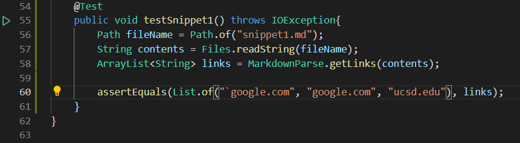
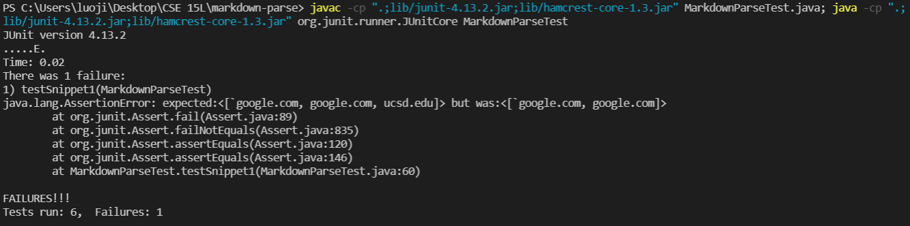
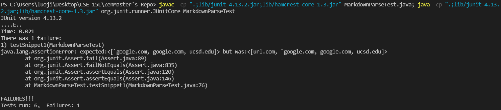
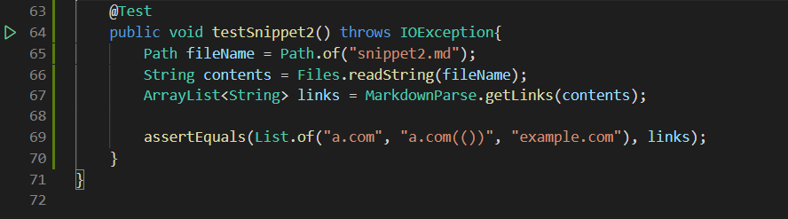
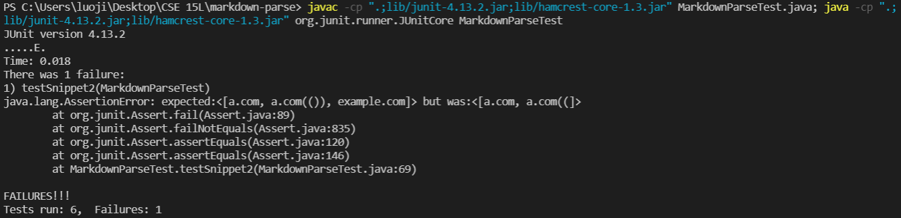
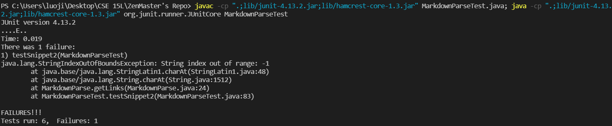
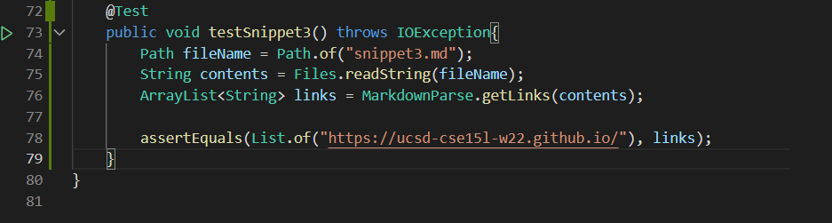
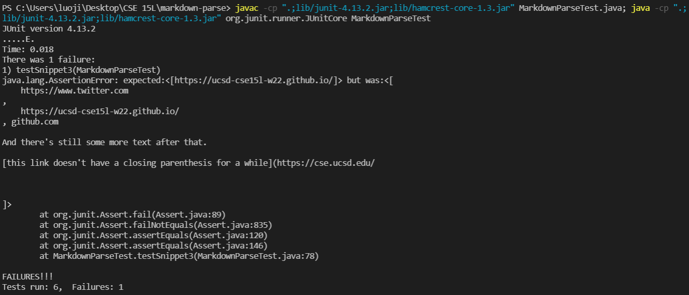
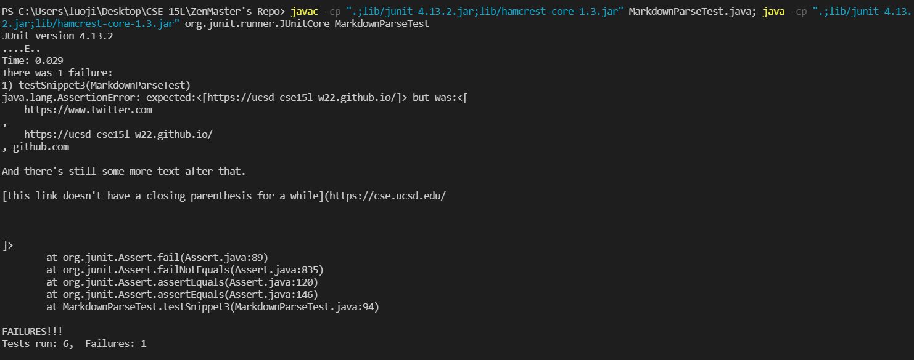

# Lab Report 4
Will Luo, A16989083, jil232@ucsd.edu, CSE 15L

My Markdown-parse link: [https://github.com/alien-traveler/markdown-parse](https://github.com/alien-traveler/markdown-parse)
My reviewed repo link: [https://github.com/TheZenMasterz/markdown-parse](https://github.com/TheZenMasterz/markdown-parse)

## Snippet 1
This snippet should produce "`google.com", "google.com", "ucsd.edu"

**Implementation in `MarkdownParseTest.java`:**

**My result:**

I can fix this bug by testing the order of backtips and brackets. So if both backtips are in the brackets, the program should catch the link in the parenthesis. If only one backtip in the brackets, the program shouldn't catch the link.

**Other's implementation:**

It will be hard to fix this bug in a few lines because this person's code does not deal with backtips at all. The code needs to catch backtips first and then compare its order with brackets.

---

## Snippet 2
This snippet should produce "a.com", "a.com(())", "example.com"

**Implementation in `MarkdownParseTest.java`:**

**My result:**

It will be hard to fix this bug in a few lines because I have not deal with multiple parenthesises and brackets. If I fix this bug for double parenthesis/brackets, another failure-inducing test could contain triple or more parenthesis/brackets. So it will be complicated to do so.

**Other's implementation:**

This person needs to deal with the situation when bracket is not out of range first. Then, this person should deal with multiple brackets/parenthesises in order to solve the problem, which might take more than ten lines. 

---

## Snippet 3
This snippet should produce "https://ucsd-cse15l-w22.github.io/"

**Implementation in `MarkdownParseTest.java`:**

**My result:**

When a pair of brackets lands in multiple lines, the code should not catch the link. If a pair of parenthesis lands in multiple lines, the code should trim the link so that there is no extra space. It should also deal with multiple parenthesis, and if they are not in pairs, the code should not catch the link. So it may take more than 10 lines to fix this snippet.

**Other's implementation:**

This person has the same issue as I do: "When a pair of brackets lands in multiple lines, the code should not catch the link. If a pair of parenthesis lands in multiple lines, the code should trim the link so that there is no extra space. It should also deal with multiple parenthesis, and if they are not in pairs, the code should not catch the link. So it may take more than 10 lines to fix this snippet."
